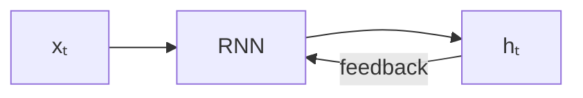

# 基于神经网络的自然语言处理方法

区别在于对于特征的处理不同
+ 文本情感分类应用：基于人工设计文本特征
+ 文本情感分类应用：基于word2vec/GloVe的文本特征
+ 前馈神经语言模型：基于前词上下文预测接下来的词
	+ 需要设定前词的窗口大小，如选择三个前词，输入这三个前词的独热向量
+ **递归神经语言模型**：基于前词上下文预测接下来的词

# 递归神经网络（RNN）

为了解决MLP等Vanilla Neural Network对前后依赖关系不能很好描述的缺点，在传统神经网络基础上，加入了隐状态——即为过去的输入上下文。  
如图：

可以看出递归之意，每次的输出都作为隐状态叠加新输入重新输入到RNN中。

$$
h_t = f_W(h_{t-1},x_t)
$$

+ W为参数
+ $h_t$为新状态,$h_{t-1}$为旧状态
+ $x_t$为某一步输入
具体模型构建一般由：
1. 嵌入层：输入长度为m的词索引向量$[52,12,31,...,123]$，根据构建好的词表，将每个词索引转变为一个n维向量，即从整数到n维向量的映射，输出$m \times n$大小的矩阵。这里的词表可以自己训练，但一般情况下使用前文提到的word2vec等预训练模型得到的词向量
2. RNN层：即递归网络
3. FC层：全连接
4. 输出层：
- RNN的优点： 
	- 能够处理任意长度数据
	- 输入变长，模型大小不变 
+ RNN的缺点: 
	- 未来状态的计算依赖于过去的状态（无法并行计算）
	- 很难处理长距离依赖（由于梯度衰减问题）

# Transformer

Transformer架构的提出，主要是为了解决传统循环神经网络（RNN）在处理序列数据时的两个**主要缺点**：
1. **长期依赖问题**：信息随时间步“稀释”，远处信息难以传递；
2. **无法并行计算**：必须按时间顺序逐步处理，效率低下。

**序列到序列变换(seq2seq)**：

在处理自然语言时的关键转化，一种编码解码架构，将原通用的，只包含语义的平凡句子特征向量序列转化为适应于特定任务的序列，实现从语言到情感，从一种语言到另一种语言，即翻译、分类、标注与问答式文本生成这些复杂的映射关系。  

**从RNN转化为注意力机制**：
+ 编码器把所有隐状态都传给解码器 
+ 解码器基于注意力机制对所有隐状态进行加权求和  

**注意力机制**：

对每个输入的词嵌入表示向量$x_i$提供三个映射：
1. Query ${q_i} = {x_i}W^Q$：映射为当前位置需要的信息，表示当前词的“搜索意图”，它需要关注哪些其他信息来实现自己的表达（如位置，上下文），比如“我”需要找到宾语或者谓语来完成自己的表达。
2. Key ${k_i} = {x_i}W^K$：映射为当前词的“可匹配特征”，表示当前词自身能够提供出哪些特征，比如“我”提供主语、宾语等语法特征，在句子中的某种位置特征等。
3. Value ${v_i} = {x_i}W^V$：映射为每个词的权重，即每个词本身表达的意思。
计算每一对Q与K的相似程度（使用点乘），之后使用**normalize,softmax**输出每一对匹配的概率，与Value加权获得最终的输出表示向量

$$
\text{AttentionScore}{ij} = \frac{q_i \cdot k_j^\top}{\sqrt{d_k}} \quad \Rightarrow \quad \alpha{ij} = \text{softmax}j(\text{AttentionScore}{ij})
$$

$$
z_i = \sum_{j=1}^{T} \alpha_{ij} \cdot v_j
$$

$z_i$即为该位置的新表示向量  

**意义阐述**：

模型学习$W^Q$来表示该词当前语境下希望从上下文中**获取何种信息**（语义需求），如在情感分析中，词 "very"可能更关注它修饰的词（如"good"）的情感强度（如何知道good可以被修饰具有正向情感由Key提取，情感具体的强度特征则需要Value提取）。  
学习$W^K$来理解该词**可以提供哪些语义特征**，同样在情感分析中，词 "good" 的 Key 向量就表示它能够提供的语义特征，比如我是一种正向情感的描述词，可以被修饰。  
学习$W^V$**保留或突出该词对于当前任务有用的部分**，如情感分析中，保留"absolutely"的情感加强语气而非语法作用，"good"负责正向评价的语义特征得到强化。  
模型通过一些可学习调节的矩阵参数将信息与特征抽象化为一种向量表示，本质是将信息与特征数字化**可学习化可运算化**；只不过相比于传统固定词向量的表示方式（直接分布式表示），这里的注意力机制将每个词的信息与特征解藕为三类——**需要，提供与自身意义**。  
模型通过这三类之间的运算构建起词与词之间的匹配关系，具体而言，模型通过将当前词的 Query 与所有词的 Key 做相似度计算，获得当前词对每个上下文中词的“关注程度”，即注意力权重。这些权重刻画了在当前任务和上下文中，哪些词对当前词的表示更有贡献。  
这个过程使得模型获得某种**attention**，动态了解某个词在某种情景下更匹配哪些上下文，注意那些完成特定任务所需要的关键的“词联系”，进而能够在输入相关词时激活上下文中关联密切的词，获得重要复杂的特征，将原普通序列转化为与任务情景高相关的序列，实现高表达能力。  

**多头注意力**：
将多个单头注意力并行计算，并将它们的输出拼接起来，乘上新加的$W^o$权重矩阵获得输出到softmax中的向量，最后normolize的时候要将原来的d变为d/h，h为头数  

**位置编码**：
RNN因为递归，天然具有词汇位置顺序信息，而transformer没有，因此需要额外的机制来引入词序信息。
多数采用基于正弦和余弦函数的固定编码方式

$$
PE_{(pos, 2i)} = \sin\left(\frac{pos}{10000^{2i/d}}\right)\qquad
PE_{(pos, 2i+1)} = \cos\left(\frac{pos}{10000^{2i/d}}\right)
$$

其中：
- pos 是词的位置（位置编号，从 0 开始）
- i 是维度索引（位置编码向量中的第 i 个维度）
- d 是词嵌入的维度（通常是模型的维度，如 512）
**在嵌入时加入**  

**残差连接与layer normalization**:
+ 和ResNet一样，利用残差连接能够帮助Transformer更好的训练。 
+ 类似于CNN中使用批归一化，Transformer使用层归一化帮助训练。  

**Encoder与decoder**：  
前馈神经网络：  
类似于MLP，CNN中的激活函数，将每个词的上下文向量进行一次非线性变换，增强表达能力。  

Encoder结构：  
子模块中包含多头自注意力机制+前馈神经网络，模块之间用残差连接和层正则化。  
输入句子词向量表示，输出每个词的上下文相关的向量表示。即把输入词句变成特征向量，编码化。  

Decoder结构：  
多用于文本生成，子模块包括Masked多头自注意力机制（防止看到未来词），多头交叉注意力机制，前馈神经网络，模块间用残差连接加正则化。  
输入目标序列的已生成部分，加上前一层encoder的输出，输出一个词序列，表示某时刻（位置）输出的词，通过softmax和词表提取出下一个输出的词。

